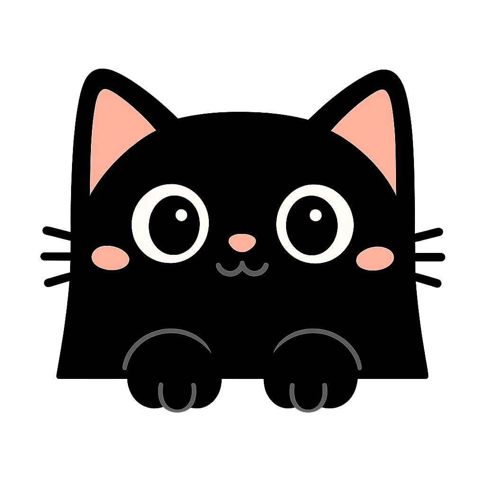

# 🐱 Kitty Reminder

A cute desktop reminder app to help you stay healthy and productive! Get gentle reminders from adorable cats to drink water, take breaks, stretch, and protect your eyes.



## ✨ Features

- 💧 **Smart Reminders** - Water, breaks, stretching, and eye protection reminders
- ⏱️ **Countdown Timer** - Simple timer with pause/resume
- 🍅 **Focus Time** - Pomodoro timer with beautiful animations
- 🔔 **Custom Notifications** - 8 different sound effects to choose from
- 🎨 **Beautiful UI** - Clean interface with warm orange theme
- 🖥️ **System Tray** - Runs quietly in the background

## 📥 Download

Download the latest version for your platform from the [Releases page](https://github.com/yourusername/kitty-reminder/releases).

**Windows:** Extract ZIP and run `Kitty Reminder.exe`  
**macOS:** Extract ZIP and drag to Applications folder  
**Linux:** Extract tar.gz and run the executable

## 🛠️ Development

```bash
# Clone and install
git clone https://github.com/yourusername/kitty-reminder.git
cd kitty-reminder
npm install

# Run
npm start

# Build
npm run package:win   # Windows
npm run package:mac   # macOS
npm run package:linux # Linux
```

## 🤝 Contributing

Contributions welcome! See [CONTRIBUTING.md](CONTRIBUTING.md) for guidelines.

## 📝 License

ISC License

---

Made with ❤️ and 🐱
